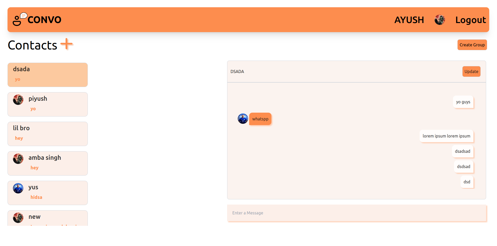

# convo

chat application made using mern stack
# home-page

# chat-page

# chat-box

# login

# signup

# add contacts

# view profile

# create group-chat

# add people in group

# edit group chat

# new ui

